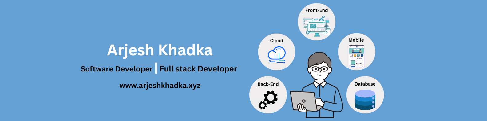

<h1 align="center">Hi  :wave: , I'm Arjesh Khadka</h1>
<h3 align="center">Software Developer | Solving real-world problems through code</h3>

  

 

- 👨‍💻 All of my projects are available at [https://www.arjeshkhadka.xyz/](https://www.arjeshkhadka.xyz/)

<h3 align="left">Connect with me:

</h3>

 

<h3 align="left">Languages and Tools:</h3>

                  

